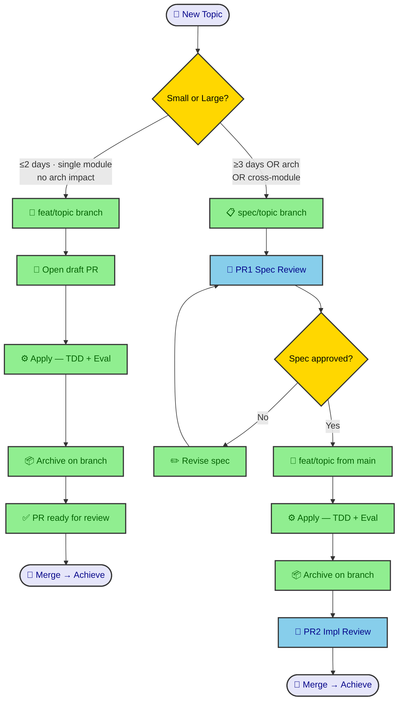
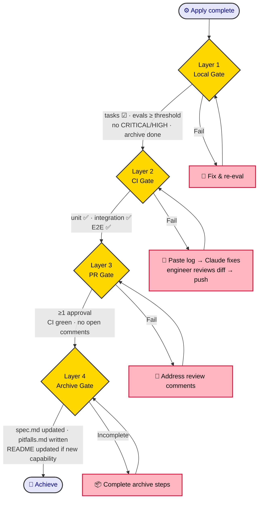
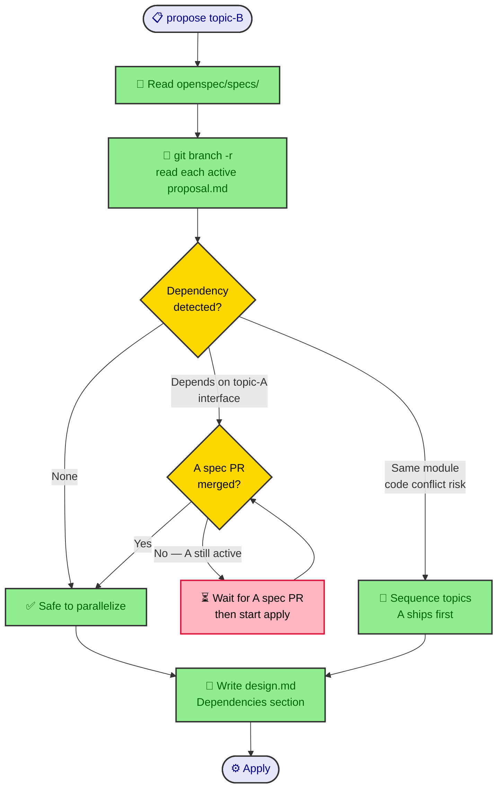

# Multi-Engineer OpenSpec Workflow — Design

**Date:** 2026-05-26  
**Status:** REVIEWED  
**Topic:** multi-engineer-workflow  
**Scope:** 2-6 engineer teams with existing CI/CD + PR review (E2E in CD pipeline)

---

## Context

OpenSpec + Superpowers was designed for single-engineer usage. With the apply harness (evaluator subagent, TDD enforcement, eval-log retry loop), features that took 2-3 days now take hours. This creates both opportunity and new constraints for team use:

- More features can run in parallel
- Bottleneck shifts from implementation to spec quality and PR review bandwidth
- Engineer role shifts from executor to judge

This design extends the four-phase flow (explore → propose → apply → archive) to teams of 2-6 engineers with CI/CD. Core patterns apply from the first engineer; Sections 7 addresses the additional scaling concerns that emerge at 4-6 people.

---

## 1. Branch + PR Model (Two-track)



### Small feature track (default)

```
main
 └─ feat/<topic>   ← built at propose time; contains spec + code + archive
```

- PR opens as draft after propose completes
- Apply runs on this branch; archive completes on this branch
- PR converts to ready when: all tasks [x], all evals pass, archive done
- Merge gate: 1 approval + CI green

**"Small" criteria (all must be true):**
- Touches ≤3 modules
- No cross-engineer interface coordination required
- No architectural implications
- Estimated apply time ≤ 2 days

**1-3 day estimate ambiguity:** Default to small track unless another large trigger fires. Estimate alone does not force large track.

### Large feature track (architecture / cross-module)

```
main
 └─ spec/<topic>        ← propose only; spec files, no code
      PR1 (Spec Review) ← team reviews and approves spec
 └─ feat/<topic>        ← created from main after spec PR merges
      PR2 (Impl Review) ← apply + archive complete
```

- PR1 contains: requirements.md, proposal.md, design.md, tasks.md — no code. tasks.md is part of spec review: task groupings and CONTRACT blocks are reviewed and can be revised during PR1. Once PR1 merges, tasks are locked.
- PR1 merge = team locks requirements, design, and task structure; none of these change during apply
- PR2 contains: all code + eval-log.md + archive output
- PR2 merge = achieve

**"Large" triggers (any one suffices):**
- Touches interfaces shared by 2+ engineers' modules
- Architectural decision requires team consensus
- Estimated apply time ≥ 3 days
- Has breaking changes to existing capability specs
- Is an architecture refactoring (use `spec/arch-<name>` — see Section 4)

---

## 2. Achieve Criteria (Four-layer Gate)



Achieve = all four layers pass. Apply finishing is necessary but not sufficient.

### Layer 1 — Local (engineer + Claude)
- All `tasks.md` items checked `[x]`
- All group eval scores ≥ threshold
- No CRITICAL/HIGH unresolved from evaluator
- `openspec archive <topic>` completed

### Layer 2 — CI (automated)
| Test type | Responsibility |
|-----------|---------------|
| Unit tests | Local validated; CI confirms |
| Integration tests | CI only (not run locally by design) |
| E2E tests | Large feature: required; Small: optional |

Integration tests are a CI-only responsibility by design: local dev environments typically lack the full service stack (external APIs, multi-container orchestration, seeded DB state). Running them locally would require environment parity that is not worth maintaining. CI has the full environment; this is the explicit trade-off.

**CI failure after PR opens:** Engineer pastes failure log to Claude. Claude fixes on the feature branch, shows the diff, engineer reviews and approves, then Claude commits and pushes. Full apply is not re-run — only the specific failure is addressed. Git history stays clean: one fix commit per CI failure, not a force-push.

### Layer 3 — PR (team)

Two-tier review. Human judgment applies to spec intent; harness + CI own code correctness.

**Spec PR review (high bar — PR1 in large track, or early draft review in small track):**
- Read requirements.md + proposal.md + design.md + tasks.md
- Ask: Is the decomposition clean? Are dependencies declared? Are CONTRACT blocks clear?
- Anyone on the team can approve. No ownership matrix needed.
- Time commitment: 15-30 minutes per spec PR.

**Code PR review (lightweight — PR2 or small track PR):**

| Check | Source |
|-------|--------|
| CI green (unit + integration + E2E)? | CI dashboard |
| All eval groups pass threshold? | eval-log.md |
| No unresolved CRITICAL/HIGH? | Final evaluator output |
| manual-ops.md complete (if exists)? | manual-ops.md |
| PR description matches spec intent? | proposal.md + PR description |

Do not do line-by-line code review. The harness + E2E CD pipeline is the primary quality gate — more reliable than manual code review.

**Who reviews:** Any engineer not owning the topic. No CODEOWNERS file. Coordinate via Slack/standup. At 4-6 people, each engineer reviews ~1-2 lightweight PRs or 1 spec PR per day — not a bottleneck.

Merge gate: ≥1 approval + all CI checks green + no unresolved comments.

### Layer 4 — Archive
- `openspec/specs/<capability>/spec.md` updated with spec deltas
- `openspec/specs/<capability>/pitfalls.md` updated by engineer/Claude during archive step. Source: eval-log retry groups (attempt > 1 = automatic candidate) + any non-obvious implementation constraints found during apply. **Pitfalls are delegated to per-capability files, not written to CLAUDE.md** — CLAUDE.md index is only updated via maintenance PR when a capability first appears (see Section 7).
- `openspec/specs/README.md` updated only if a **new** capability is created (not for updates)
- `README.md` updated only if user-visible behavior changed

**Summary:** Apply ends when local eval passes. Achieve happens when PR merges to main and archive completes.

---

## 3. Parallel Development + Conflict Resolution

### Isolation principle



One engineer owns one topic end-to-end. No split ownership of a single topic.

Parallel safety requires two topics not touching the same module. Conflicts are discovered at **propose time**, not merge time:

```
During propose <topic-B>:
  → Read openspec/specs/ (all existing capability specs)
  → Run: git branch -r | grep 'feat/\|spec/' to list active branches
  → Read proposal.md of each active branch
  → Write in design.md Dependencies section:
      "depends on: <topic-A> (needs auth interface stable)"
      "conflicts with: none"
```

If B depends on A's interface → A's spec PR must merge before B enters apply. Not "can't parallelize" — "interface must lock before parallel implementation starts."

**Stale branch handling:** If a referenced branch hasn't moved in 5+ days, flag it in design.md and check with the owner before depending on it. A branch that will never merge is a dependency risk — prefer depending on already-merged specs when possible.

### Two conflict types

**Type 1: Code conflict (merge conflict)**  
Normal git conflict. Rebase + resolve. Claude handles on request.

**Type 2: Opinion conflict (spec or approach disagreement)**

| Conflict point | Resolution |
|----------------|-----------|
| Implementation detail | Evaluator arbitrates: whichever approach scores higher against spec |
| Design decision | Write both options + tradeoffs in design.md Alternatives section; team sync decides; record in design.md Decisions |
| Requirements interpretation | Return to explore; rewrite ambiguous section in requirements.md; re-run brainstorming review |
| Persistent deadlock | Topic owner decides; decision written into design.md. If topic owner is the blocking party (not the implementer), escalate: post both positions in PR comments with a 24h response window; whoever responds decides. No response = topic owner proceeds. |

### Change sizing + allocation

**Sizing:**
- Small track: 1 day, single module, no cross-engineer interface
- Large track: 3-10 days, cross-module, needs spec PR

**Allocation rules:**
- Assign by module ownership, not task difficulty
- Topics with dependency: the dependency ships first (or interface spec locks first)
- Never split a single topic across two engineers — make the topic smaller instead

---

## 4. Architecture Refactoring (Fan-out Pattern)

Architecture changes touching multiple modules use a two-phase fan-out:

### Phase 1: Arch spec topic (spec only, no code)

```
spec/arch-<name>
  proposal.md    ← Why + target architecture
  design.md      ← Before/After diagram, all sub-topics + dependency order
  tasks.md       ← Single task: team review + approve
```

PR1 (Arch Spec Review) merge = team aligns on new architecture. All sub-topics reference this spec. The arch spec PR does **not** create capability spec files — those are created/updated by each sub-topic during its own archive step. The arch spec only defines the plan and dependency order.

### Phase 2: Sub-topics in dependency order

```
arch-<name>
  ├─ feat/sub-a     ← foundation layer (no deps, runs first)
  ├─ feat/sub-b     ← depends on sub-a (starts after sub-a merges)
  └─ feat/sub-c     ← depends on sub-a (can parallel with sub-b)
```

Each sub-topic's design.md includes: `Arch ref: arch-<name>`.

**Stale specs during refactor:** Mark capability specs with `Status: MIGRATING` in frontmatter. Cleanup rule: the **last sub-topic in dependency order** that touches a given capability owns the status flip from `MIGRATING` to `ACTIVE`. The arch spec PR's design.md must explicitly declare which sub-topic is last for each capability — this is part of the arch spec review. That sub-topic's tasks.md includes the status flip as an explicit archive task, not optional cleanup.

---

## 5. Archived Spec Management

### What accumulates

After each archive, capability specs live at `openspec/specs/<capability>/spec.md`. This is the project's living knowledge base.

Claude uses it automatically during apply — reading `openspec/specs/` gives Claude awareness of existing capability contracts, preventing duplication and breakage.

### Maintenance

Keep `openspec/specs/README.md` current: one line per capability with user story + status. This is the primary navigation artifact.

Each capability spec `## Purpose` section (required by archive cleanup) serves as the LLM-readable summary.

**Lightweight dependency tracking:** Add `depends_on:` to each capability spec's YAML frontmatter. Grepping this reconstructs the dependency graph without tooling.

```yaml
---
capability: auth
depends_on: [user-store, session]
status: ACTIVE
---
```

### When to invest in tooling

`depends_on:` frontmatter fields are the spec graph data — they exist from the start. What changes at scale is whether to build **visualization tooling** on top of that data.

| Tool | Invest when |
|------|------------|
| `openspec/specs/README.md` | Now — low cost, high value |
| `depends_on:` frontmatter | Now — add to every new capability spec at archive time |
| Spec graph visualization (rendered graph) | > 15 capability specs |
| Auto-generated LLM wiki | 5+ person team, onboarding cost is high |

For 2-3 people: `grep depends_on openspec/specs/*/spec.md` reconstructs the dependency graph on demand. No visualization tool needed yet.

---

## 6. Engineer Role in AI-Accelerated Development

With the apply harness handling TDD, eval, and code review automatically, engineer time shifts from execution to judgment.

### What engineers do now

**Spec authorship (highest leverage)**  
Apply quality = spec quality. 30 minutes of precise spec writing produces 3 hours of clean apply. Vague specs produce passing evals that miss intent. Engineers become requirements translators: converting product intent into SHALL statements Claude can execute precisely.

**Spec fidelity review (not code review)**  
PR review is no longer primarily about code correctness — the evaluator already checked that. It is about:
- Did Claude implement the spec's intent, or just its literal wording?
- Did eval pass because the spec was good, or because it was too vague to fail?
- Are edge cases and error handling captured in the spec, or silently missing?

**Architecture judgment**  
Who writes `spec/arch-<name>`? Who decomposes sub-topics? Who defines module boundaries? These decisions require understanding of system evolution direction — Claude cannot make them.

**Product and business judgment**  
Is this the right feature to build? What is the actual user problem behind the requirement? Explore phase discussion quality directly determines whether apply produces the right thing.

**Anomaly handling**  
CI failures Claude cannot see, manual ops, third-party console operations, persistent eval plateaus that require human escalation.

### What changes at team level

| Before | After |
|--------|-------|
| Implementation = core work | Spec writing = core work |
| Senior = fastest coder | Senior = sharpest spec author + architecture thinker |
| Bottleneck = implementation speed | Bottleneck = PR review bandwidth + spec quality |
| Feature takes 2-3 days | Feature takes hours; more can run in parallel |

**Core shift:** Engineering time moves from "writing code" to "deciding what to build and verifying AI built it correctly." Speed is no longer the constraint. Judgment is the scarce resource.

---

## 7. Shared File Architecture (4-6 Person Scaling)

At 2-3 people, shared files (`CLAUDE.md`, `openspec/specs/README.md`, `openspec/config.yaml`) are rarely a problem. At 4-6 people with parallel archives, concurrent writes cause merge conflicts and become a bottleneck. The fix: archive only ever touches per-capability files.

### CLAUDE.md structure

CLAUDE.md becomes a short, stable index. It is **not updated at archive time**.

```markdown
# CLAUDE.md

## Project Context
[Short project description — rarely changes]

## Capability Pitfalls
Pitfalls stored per capability. Read the relevant file during apply:
- auth: openspec/specs/auth/pitfalls.md
- payment: openspec/specs/payment/pitfalls.md
- notifications: openspec/specs/notifications/pitfalls.md

## Global Pitfalls
[Cross-cutting pitfalls only. Keep < 5 entries. Overflow moves to maintenance PR.]
```

### Per-capability pitfalls file

Created at first archive of a capability. Updated at every subsequent archive of that capability. Different capabilities = different files = parallel archives never conflict.

```
openspec/specs/<capability>/pitfalls.md
```

```markdown
# Auth Pitfalls

- Token refresh race: lock mutex before checking expiry (eval-log attempt 2, 2026-05-20)
- JWT secret rotation requires process restart — env var change alone not enough
```

### openspec/specs/README.md

Updated **only when a new capability is created** — this happens in the spec PR (large track), not at archive time. Updating an existing capability never touches README.md; the capability's own `spec.md` Purpose section is the source of truth.

### openspec/config.yaml

Changes (new test command, new e2e command, stack changes) are infrequent and go through a dedicated `chore: config-update` PR. Never tied to a feature archive.

### Maintenance PR cadence

| Trigger | Contents | Review |
|---------|----------|--------|
| CLAUDE.md Global Pitfalls approaches 5 entries | Consolidate: entries with a clear capability home move to that capability's pitfalls.md; truly cross-cutting entries stay | 1 approval, no CI dependency |
| Sprint end | Verify CLAUDE.md index lists all capabilities added this sprint | 1 approval |
| config.yaml change needed | Standalone `chore: config-update` PR | 1 approval |

Global Pitfalls entries accumulate only when a pitfall has no clear capability home (genuinely cross-cutting). Most pitfalls have a home and go directly to per-capability files at archive time — the Global section grows slowly by design.

Any engineer can open a maintenance PR. Not tied to feature work.

### Result

Simultaneous archives from multiple engineers produce zero shared-file conflicts:
- Each writes to `openspec/specs/<their-cap>/pitfalls.md` — different files
- Each writes to `openspec/specs/<their-cap>/spec.md` — different files  
- CLAUDE.md, README.md, config.yaml untouched at archive time

---

## Summary: Agile Mapping

The explore → propose → apply → archive flow maps directly onto agile:

| Agile | OpenSpec |
|-------|---------|
| Story refinement | explore (requirements.md) |
| Sprint planning | propose (tasks.md) |
| Sprint execution | apply (TDD + eval harness) |
| Sprint review + retro | archive (capability spec + CLAUDE.md pitfalls) |

Velocity metric shifts from "story points completed" to "capability specs archived this sprint + CI green." Count is absolute (e.g., 3 capabilities archived this sprint), not a ratio.
