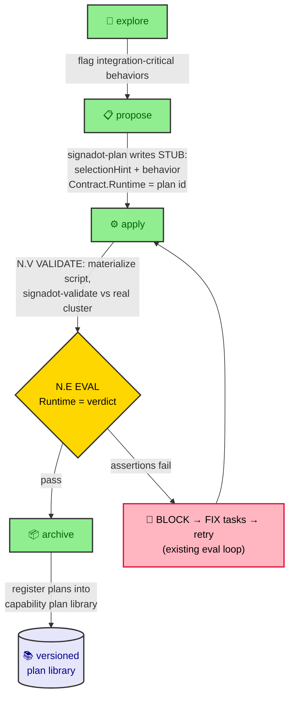

# OpenSpec + Superpowers × Signadot — Integration Workflow

How [Signadot](https://www.signadot.com) **plans** and the `signadot-validate` runner fold into the four-phase flow (`explore → propose → apply → archive`), so integration validation against a real cluster happens **inside the apply session, before the PR exists**.

> Companion to [`workflow.md`](workflow.md). The four phases, slash commands, Contract blocks, and the evaluator harness are unchanged — read `workflow.md` first. This doc covers only what Signadot **adds**, for **single-engineer** use. The team four-layer-gate version is a later pass (see [Open edges](#open-edges)).
>
> Sources: [Signadot — "CI wasn't built for coding agents"](signadot/talk%20with%20ani%20-%20Snapadot), notes in [`signadot/和Ani的交流.md`](signadot/和Ani的交流.md).

---

## Core thesis (one line)

A Signadot **plan** is the executable form of a spec **Scenario**. `signadot-validate` is the real-cluster verifier that fills the **Runtime** dimension of the Contract/EVAL machinery OpenSpec already has. Nothing new is bolted on the side — the Runtime field stops being a guess and becomes a verdict.

```
spec Scenario  ──authored as──▶  signadot plan (selectionHint + DAG)
                                          │
                                  signadot-validate runs it
                                  vs ephemeral real cluster
                                          │
                                          ▼
                          Contract.Runtime verdict  ──feeds──▶  N.E EVAL (40% Runtime)
```

---

## 1. Mental-model mapping

| Signadot | OpenSpec | Why they line up |
|----------|----------|------------------|
| **Action** (typed deterministic block: `request-http`, `playwright`, `k6`) | — (infra primitive, project-level) | Lives in the shared **action catalog**, not authored per feature |
| **Plan** (DAG of actions, one user-visible behavior, carries `selectionHint`) | executable form of a spec **Scenario** | Both describe exactly one user-visible behavior end-to-end |
| **`selectionHint`** (prose: what this plan validates) | Scenario description / behavior name | Lets an agent pick the right plan for a diff |
| **`signadot-validate`** verdict (structured pass/fail report) | the **Runtime** dimension of `### Contract` + `N.E EVAL` | Real-cluster result replaces the subagent's Runtime guess |
| **ephemeral environment** | (none — self-summoned by the runner) | Not a per-topic artifact; created and torn down per run |
| **versioned plan library** | archived capability plans | The durable "what *correct* means" reference for each capability |

**The split that matters:** authoring a plan (`signadot-plan`) and running one (`signadot-validate`) are different work. Authoring is a **propose**-phase concern (it's spec-shaped — *what correct means*). Running is an **apply**-phase concern (it's verification — *did the code achieve it*).

---

## 2. Per-phase integration



### explore — light touch

Discussion flags which behaviors are **integration-critical** — cross-service, real-downstream, the kind that compiles and passes unit tests but breaks the system (the article's `Name → LocationName` refactor). These become **plan candidates**. No Signadot artifact is written yet; this is just awareness carried into propose.

### propose — hybrid authoring, **behavior layer only**

This mirrors the existing Contract pattern exactly: the *block* is written at propose, the *materialized file* is produced at apply.

- `signadot-plans/` directory is pre-created in the change dir, alongside the existing `contracts/` and `eval-log.md`.
- For each integration-critical behavior, `signadot-plan` writes a **stub**:
  - `selectionHint` — prose describing what this plan validates
  - the behavior, in natural language
  - which task group(s) it covers
  - **no DAG / no script yet** — concrete endpoints and fields may not exist until apply
- The group's `### Contract` block gains the binding. The **Runtime** field changes from prose to a reference:

  ```
  ### Contract
  Spec:      <SHALL statements covered>
  Runtime:   validated by signadot plan `ride-request-itinerary`
  Code:      <files / interfaces touched>
  Threshold: <score>
  ```

- **Not every group gets a plan.** Pure-logic groups with no user-visible behavior keep prose Runtime and fall back to subagent judgment at EVAL.
- Because stubs are committed at propose, they land on the **spec review surface** — a human reviews *what correct means* before any code is written.

### apply — materialize + run

Per group **that has a bound plan**, one new step slots between GREEN and EVAL:

| Step | Status | What happens |
|------|--------|--------------|
| `N.0 CONTRACT` | existing | now also confirms the bound plan id |
| `N.X RED` / `N.X+1 GREEN` | existing | unchanged |
| **`N.V VALIDATE`** | **new** | materialize the full DAG/`playwright` script into `signadot-plans/<id>.yaml`; run `signadot-validate` → it **self-summons** the ephemeral env, runs against the **real cluster**, returns a structured report; tears the env down |
| `N.E EVAL` | existing | the evaluator reads the **validate report as the Runtime evidence** |

**The gate semantics (this is the whole point):**

- `N.E EVAL`'s **Runtime** dimension (40% of the score) is now sourced from the `signadot-validate` verdict — a real-cluster result, not the subagent guessing from a local/mocked run.
- Any failed assertion → Runtime floored → **immediate BLOCK** (same severity as a CRITICAL from the evaluator).
- BLOCK → append FIX tasks → **reuse the existing eval retry loop** (max 3 attempts, plateau < 5pt → escalate to human). No new retry machinery is introduced.

Groups without a plan are unchanged — EVAL scores Runtime by subagent judgment as today.

### archive — plans become durable

Plans are not throwaway. New cleanup step at archive:

- Register / move the topic's validated plans into the capability's reusable library:

  ```
  openspec/specs/<capability>/plans/<id>.yaml
  ```

- The accumulating `selectionHint` catalog **is** the versioned plan library the article describes — a reference agents validate against and humans read to understand the system.
- Plans now join the living knowledge base Claude reads during apply (alongside `spec.md` and `pitfalls.md`), so future changes touching the same behavior get pre-existing coverage.

---

## 3. Project prerequisite (one-time, not per-topic)

Treated exactly like "CI is set up" — a precondition, never a per-feature task:

- Signadot connected to the Kubernetes cluster
- the **action catalog** present (the typed building blocks plans compose from)

Documented as a bootstrap precondition in this doc and in `openspec/config.yaml`. The ephemeral environment is **self-summoned and torn down by `signadot-validate` on every run** — there is deliberately **no per-topic build-environment task** (matches the article: "environments are no longer the hard part").

---

## 4. What this changes (single-engineer)

| Before | After (with Signadot) |
|--------|-----------------------|
| Integration bugs surface in staging, after PR | Surface inside the apply loop, before PR exists |
| Contract **Runtime** field = subagent's guess from local/mocked run | Real-cluster verdict against the modified service |
| EVAL's 40% Runtime weight is soft | Runtime weight has teeth — backed by an actual run |
| Validation = local unit/integration only | Plus real downstream services, on demand, per behavior |
| Plans = nothing | A versioned, reviewable library of "what correct means" per capability |

The diff that opens as a PR is already validated against the real cluster, with an env URL and a plan run anyone can audit. Downstream review becomes a review of **behavior**, not a stand-in for validation.

---

## 5. Artifact layout (delta over `workflow.md`)

```
openspec/changes/<topic>/
  proposal.md
  specs/<cap>/spec.md
  design.md
  tasks.md                    ← Contract blocks now bind Runtime → plan id
  contracts/
    group-N.md
  signadot-plans/             ← NEW (pre-created at propose, like contracts/)
    <behavior-id>.yaml        ←   stub at propose, materialized at apply N.V
  eval-log.md                 ← Runtime evidence now includes validate verdict
  manual-ops.md               ← optional

openspec/specs/<capability>/
  spec.md
  pitfalls.md
  plans/                      ← NEW: durable plan library (archive registers here)
    <behavior-id>.yaml
```

---

## <a id="open-edges"></a>6. Open edges (noted, deferred)

- **Plan ↔ group cardinality** — a plan validates one *behavior end-to-end*, which may span several task groups, while EVAL is per-group. Binding is by `selectionHint`: the plan runs when its covered groups are done, and its verdict feeds the Runtime of those groups' EVAL. The general N-plans-to-M-groups mapping is left to the implementation pass.
- **Team four-layer gate** — in [`workflow-team.md`](workflow-team.md), integration tests live in **Layer 2 (CI)**. Signadot's thesis pulls them up into **Layer 1 (Local apply)**, demoting staging to a final sanity check. The team-gate rewrite is a **separate, later doc** — out of scope here by design.
- **Concrete `signadot-plans/` schema** — this doc is conceptual. The exact stub format, the `signadot-plan` / `signadot-validate` skill invocation contract, and the action-catalog wiring are an implementation pass once the concept is approved.

---

> Status: concept. Single-engineer scope. Team version pending review of this doc.
