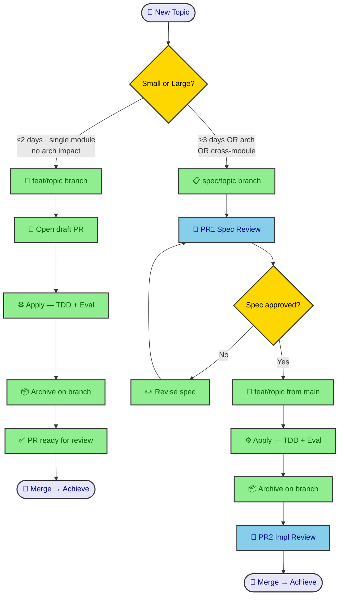
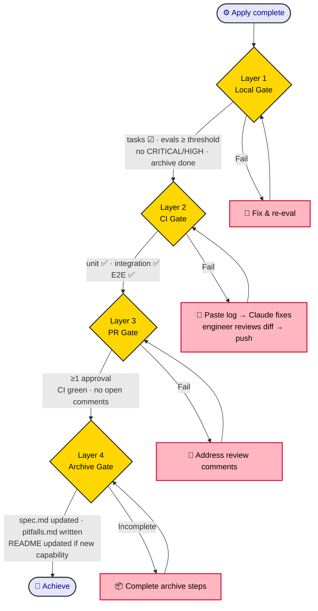
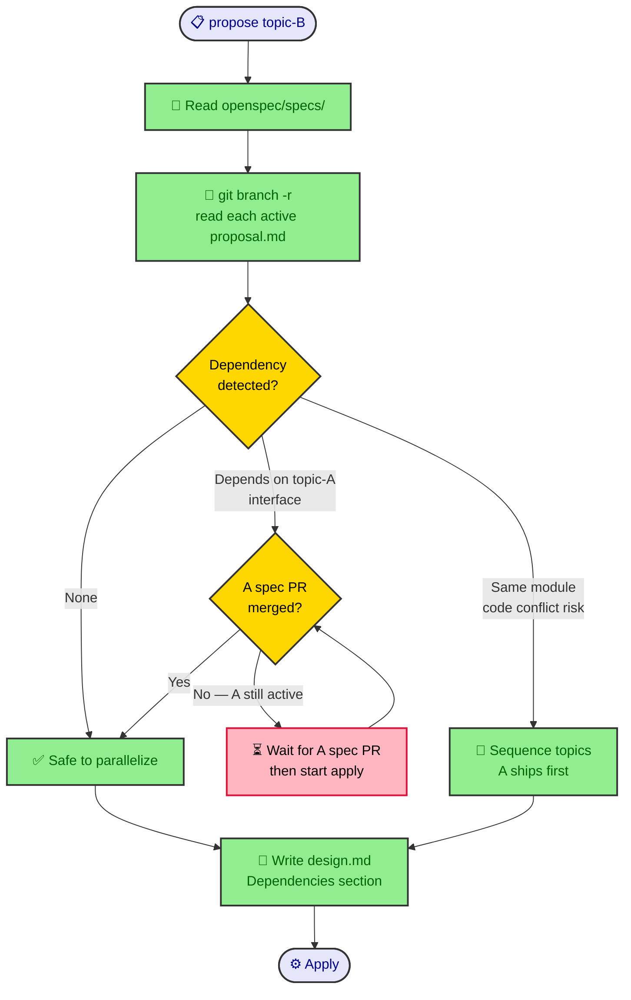

# OpenSpec + Superpowers — Team Workflow

How the four-phase flow (`explore → propose → apply → archive`) scales from one engineer to a **2–6 person team with CI/CD + PR review**.

> This is the team companion to [`workflow.md`](workflow.md). The four phases, slash commands, and per-phase mechanics are unchanged — read `workflow.md` first. This doc covers only what is **added** for team use: branching, the achieve gate, parallel safety, architecture fan-out, spec knowledge-base management, the engineer role shift, and shared-file scaling at 4–6 people.
>
> Source design: [`specs/2026-05-26-multi-engineer-workflow-design.md`](superpowers/specs/2026-05-26-multi-engineer-workflow-design.md).

---

## Why a team flow at all

The apply harness (evaluator subagent, TDD enforcement, eval-log retry loop) collapsed 2–3 day features into hours. That changes the team math:

- More features run in parallel.
- The bottleneck moves from **implementation speed** to **spec quality + PR review bandwidth**.
- The engineer role moves from **executor** to **judge**.

Core patterns below apply from the very first engineer. Section 7 (shared files) only matters at 4–6 people.

---

## 1. Branch + PR model (two-track)

One engineer owns one topic end-to-end. Pick a track per topic by size.



### Small track (default) — one branch, one PR

```
main
 └─ feat/<topic>   ← built at propose time; holds spec + code + archive
```

- Draft PR opens after propose completes.
- Apply + archive both run on this branch.
- PR converts to **ready** when: all tasks `[x]`, all evals pass, archive done.
- Merge gate: **1 approval + CI green**.

**"Small" — all four must hold:**

- Touches ≤3 modules
- No cross-engineer interface coordination
- No architectural implications
- Apply estimate ≤2 days

**1–3 day ambiguity:** default to small unless another large trigger fires. Estimate alone never forces large.

### Large track (architecture / cross-module) — two branches, two PRs

```
main
 └─ spec/<topic>        ← propose only; spec files, no code
      PR1 (Spec Review) ← team reviews + approves spec
 └─ feat/<topic>        ← created from main AFTER spec PR merges
      PR2 (Impl Review) ← apply + archive complete
```

- **PR1** = `requirements.md` + `proposal.md` + `design.md` + `tasks.md`, **no code**. Task groupings and CONTRACT blocks are part of spec review. PR1 merge **locks** requirements, design, and task structure — none change during apply.
- **PR2** = all code + `eval-log.md` + archive output. PR2 merge = achieve.

**"Large" — any one trigger suffices:**

- Touches interfaces shared by 2+ engineers' modules
- Architectural decision needs team consensus
- Apply estimate ≥3 days
- Breaking changes to existing capability specs
- Architecture refactor → use `spec/arch-<name>` (Section 4)

---

## 2. Achieve criteria — four-layer gate

**Apply finishing is necessary but not sufficient.** Achieve = all four layers pass.



### Layer 1 — Local (engineer + Claude)

- All `tasks.md` items `[x]`
- All group eval scores ≥ threshold
- No CRITICAL/HIGH unresolved from evaluator
- `openspec archive <topic>` completed

### Layer 2 — CI (automated)

| Test type | Responsibility |
|-----------|----------------|
| Unit | Local validated; CI confirms |
| Integration | **CI only** — not run locally by design |
| E2E | Large feature: required · Small: optional |

Integration tests are CI-only on purpose: local dev rarely has the full service stack (external APIs, multi-container orchestration, seeded DB). CI has the parity; that's the trade-off.

**CI fails after PR opens:** paste the failure log to Claude → Claude fixes on the feature branch → shows diff → engineer approves → commit + push. Do **not** re-run full apply. One fix commit per failure, no force-push. History stays clean.

### Layer 3 — PR (team) — two tiers

Human judgment owns **spec intent**; harness + CI own **code correctness**.

**Spec PR review (high bar — PR1, or early draft review in small track), 15–30 min:**

- Read `requirements.md` + `proposal.md` + `design.md` + `tasks.md`
- Ask: Is the decomposition clean? Dependencies declared? CONTRACT blocks clear?
- Anyone on the team can approve. No ownership matrix.

**Code PR review (lightweight — PR2 or small-track PR):**

| Check | Source |
|-------|--------|
| CI green (unit + integration + E2E)? | CI dashboard |
| All eval groups pass threshold? | `eval-log.md` |
| No unresolved CRITICAL/HIGH? | Final evaluator output |
| `manual-ops.md` complete (if exists)? | `manual-ops.md` |
| PR description matches spec intent? | `proposal.md` + PR description |

**No line-by-line code review.** The harness + E2E CD pipeline is the primary quality gate — more reliable than manual reading.

**Who reviews:** any engineer not owning the topic. No CODEOWNERS. Coordinate via Slack/standup. At 4–6 people that's ~1–2 lightweight PRs or 1 spec PR per engineer per day — not a bottleneck.

**Merge gate:** ≥1 approval + all CI green + no unresolved comments.

### Layer 4 — Archive

- `openspec/specs/<capability>/spec.md` updated with spec deltas
- `openspec/specs/<capability>/pitfalls.md` written by engineer/Claude. Source: eval-log retry groups (`attempt > 1` = automatic candidate) + non-obvious constraints found during apply. **Pitfalls go to per-capability files, not CLAUDE.md** (Section 7).
- `openspec/specs/README.md` updated **only if a new capability is created**
- project `README.md` updated **only if user-visible behavior changed**

> **Apply ends when local eval passes. Achieve happens when the PR merges to main and archive completes.**

---

## 3. Parallel development + conflict resolution

Conflicts are caught at **propose time**, not merge time.



### Isolation rule

One engineer owns one topic end-to-end. **No split ownership of a single topic.** Parallel safety = two topics not touching the same module.

During `propose <topic-B>`:

```
→ Read openspec/specs/ (all existing capability specs)
→ git branch -r | grep 'feat/\|spec/'   (list active branches)
→ Read proposal.md of each active branch
→ Write design.md Dependencies section:
     "depends on: <topic-A> (needs auth interface stable)"
     "conflicts with: none"
```

If B depends on A's interface → **A's spec PR must merge before B enters apply**. Not "can't parallelize" — "interface must lock before parallel implementation starts."

**Stale branch:** if a referenced branch hasn't moved in 5+ days, flag it in `design.md` and check with the owner before depending on it. Prefer depending on already-merged specs.

### Two conflict types

**Type 1 — Code conflict (merge conflict):** normal git. Rebase + resolve. Claude handles on request.

**Type 2 — Opinion conflict (spec / approach disagreement):**

| Conflict point | Resolution |
|----------------|------------|
| Implementation detail | Evaluator arbitrates — higher score against spec wins |
| Design decision | Write both options + tradeoffs in `design.md` Alternatives; team sync decides; record in Decisions |
| Requirements interpretation | Return to explore; rewrite ambiguous section; re-run brainstorming review |
| Persistent deadlock | Topic owner decides, recorded in `design.md`. If the owner is the **blocking** party (not implementer), escalate: post both positions in PR comments with a 24h window; whoever responds decides. No response = owner proceeds. |

### Sizing + allocation

- **Small:** 1 day, single module, no cross-engineer interface
- **Large:** 3–10 days, cross-module, needs spec PR

Allocation rules:

- Assign by **module ownership**, not task difficulty
- Dependency → the dependency ships first (or its interface spec locks first)
- Never split one topic across two engineers — **make the topic smaller instead**

---

## 4. Architecture refactoring — fan-out pattern

Changes touching multiple modules use a two-phase fan-out.

### Phase 1 — Arch spec topic (spec only, no code)

```
spec/arch-<name>
  proposal.md    ← Why + target architecture
  design.md      ← Before/After, all sub-topics + dependency order
  tasks.md       ← Single task: team review + approve
```

PR1 (Arch Spec Review) merge = team aligns on the new architecture. All sub-topics reference this spec. The arch spec PR does **not** create capability spec files — each sub-topic creates/updates those during its own archive. The arch spec only defines plan + dependency order.

### Phase 2 — Sub-topics in dependency order

```
arch-<name>
  ├─ feat/sub-a     ← foundation layer (no deps, runs first)
  ├─ feat/sub-b     ← depends on sub-a (starts after sub-a merges)
  └─ feat/sub-c     ← depends on sub-a (can parallel with sub-b)
```

Each sub-topic's `design.md` includes `Arch ref: arch-<name>`.

**Stale specs during refactor:** mark capability specs `Status: MIGRATING` in frontmatter. The **last sub-topic in dependency order** that touches a capability owns the flip `MIGRATING → ACTIVE`. The arch spec `design.md` must declare which sub-topic is last for each capability (reviewed in PR1). That sub-topic's `tasks.md` includes the status flip as an explicit archive task — not optional cleanup.

---

## 5. Archived spec management — the living knowledge base

After each archive, capability specs live at `openspec/specs/<capability>/spec.md`. Claude reads `openspec/specs/` automatically during apply → awareness of existing contracts → prevents duplication and breakage.

### Maintenance

- Keep `openspec/specs/README.md` current: one line per capability (user story + status). Primary navigation artifact.
- Each spec's `## Purpose` section is the LLM-readable summary (required by archive cleanup).
- **Lightweight dependency tracking** — add `depends_on:` to each spec's frontmatter. Grep reconstructs the graph, no tooling:

```yaml
---
capability: auth
depends_on: [user-store, session]
status: ACTIVE
---
```

### When to invest in tooling

`depends_on:` data exists from day one. What scales is whether to build **visualization** on top.

| Tool | Invest when |
|------|-------------|
| `openspec/specs/README.md` | Now — low cost, high value |
| `depends_on:` frontmatter | Now — every new capability spec at archive time |
| Spec graph visualization | > 15 capability specs |
| Auto-generated LLM wiki | 5+ person team, high onboarding cost |

For 2–3 people: `grep depends_on openspec/specs/*/spec.md` is enough.

---

## 6. Engineer role in AI-accelerated development

The harness handles TDD, eval, and code review. Engineer time shifts from execution to judgment.

**Spec authorship (highest leverage).** Apply quality = spec quality. 30 min of precise spec → 3 hours of clean apply. Vague specs produce passing evals that miss intent. Engineers are requirements translators: product intent → SHALL statements Claude executes precisely.

**Spec fidelity review (not code review).** The evaluator already checked correctness. PR review asks:

- Did Claude implement the spec's intent, or just its literal wording?
- Did eval pass because the spec was good, or too vague to fail?
- Are edge cases + error handling in the spec, or silently missing?

**Architecture judgment.** Who writes `spec/arch-<name>`? Who decomposes sub-topics and defines module boundaries? Claude can't make these calls.

**Product/business judgment.** Is this the right feature? What's the real user problem? Explore-phase quality decides whether apply builds the right thing.

**Anomaly handling.** CI failures Claude can't see, manual ops, third-party console work, eval plateaus needing human escalation.

| Before | After |
|--------|-------|
| Implementation = core work | Spec writing = core work |
| Senior = fastest coder | Senior = sharpest spec author + architect |
| Bottleneck = implementation speed | Bottleneck = PR review bandwidth + spec quality |
| Feature takes 2–3 days | Feature takes hours; more run in parallel |

**Core shift:** time moves from "writing code" to "deciding what to build and verifying AI built it right." Speed is no longer the constraint — judgment is the scarce resource.

---

## 7. Shared-file architecture (4–6 person scaling)

At 2–3 people, shared files (`CLAUDE.md`, `openspec/specs/README.md`, `openspec/config.yaml`) are rarely a problem. At 4–6 with parallel archives, concurrent writes cause merge conflicts. **Fix: archive only ever touches per-capability files.**

### CLAUDE.md — short, stable index, NOT updated at archive time

```markdown
# CLAUDE.md

## Project Context
[Short project description — rarely changes]

## Capability Pitfalls
Pitfalls stored per capability. Read the relevant file during apply:
- auth: openspec/specs/auth/pitfalls.md
- payment: openspec/specs/payment/pitfalls.md

## Global Pitfalls
[Cross-cutting only. Keep < 5 entries. Overflow → maintenance PR.]
```

### Per-capability pitfalls file

Created at first archive of a capability, updated at every later archive of it. Different capabilities = different files = **parallel archives never conflict.**

```
openspec/specs/<capability>/pitfalls.md
```

```markdown
# Auth Pitfalls

- Token refresh race: lock mutex before checking expiry (eval-log attempt 2, 2026-05-20)
- JWT secret rotation requires process restart — env var change alone not enough
```

### openspec/specs/README.md

Updated **only when a new capability is created** — that happens in the spec PR (large track), not at archive time. Updating an existing capability never touches README.md; the capability's own `spec.md` Purpose is the source of truth.

### openspec/config.yaml

New test command, e2e command, stack changes — infrequent, go through a dedicated `chore: config-update` PR. Never tied to a feature archive.

### Maintenance PR cadence

| Trigger | Contents | Review |
|---------|----------|--------|
| Global Pitfalls nears 5 entries | Consolidate: entries with a capability home move to that file; truly cross-cutting stay | 1 approval, no CI dependency |
| Sprint end | Verify CLAUDE.md index lists all capabilities added this sprint | 1 approval |
| config.yaml change needed | Standalone `chore: config-update` PR | 1 approval |

Most pitfalls have a capability home and go straight to per-capability files at archive time. The Global section grows slowly by design. Any engineer can open a maintenance PR.

### Result — zero shared-file conflicts on simultaneous archives

- Each writes `openspec/specs/<their-cap>/pitfalls.md` — different files
- Each writes `openspec/specs/<their-cap>/spec.md` — different files
- CLAUDE.md, README.md, config.yaml untouched at archive time

---

## Agile mapping

The four-phase flow maps directly onto agile:

| Agile | OpenSpec |
|-------|----------|
| Story refinement | explore (`requirements.md`) |
| Sprint planning | propose (`tasks.md`) |
| Sprint execution | apply (TDD + eval harness) |
| Sprint review + retro | archive (capability spec + pitfalls) |

Velocity metric shifts from "story points completed" to **"capability specs archived this sprint + CI green"** — absolute count (e.g. 3 capabilities archived), not a ratio.

---

## Quick reference — single vs team

| Dimension | Single engineer ([`workflow.md`](workflow.md)) | Team (this doc) |
|-----------|-----------------|-----------------|
| Branching | One branch per topic | Two-track: small (1 PR) / large (spec PR + impl PR) |
| Achieve | Local eval passes | Four-layer gate (Local → CI → PR → Archive) |
| Conflict | n/a | Detected at propose time; code vs opinion split |
| Arch change | Single topic | `spec/arch-<name>` fan-out into ordered sub-topics |
| Pitfalls | CLAUDE.md | Per-capability `pitfalls.md` (CLAUDE.md = index) |
| Review | Self + evaluator | Evaluator owns code; humans own spec intent |
| Bottleneck | Apply time | PR review bandwidth + spec quality |
