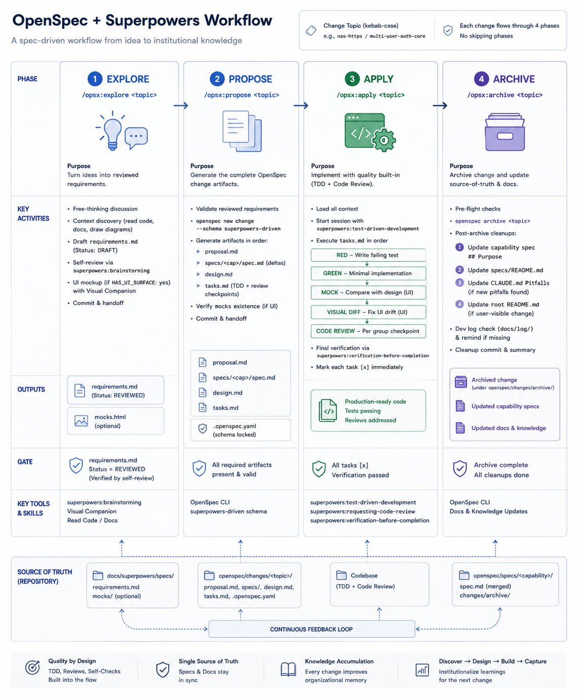

# OpenSpec + Superpowers Workflow

Four-phase structured development with hard-boundary gates. TDD and code review are wired in automatically — not optional add-ons.



*4 phases — Purpose / Key Activities / Outputs / Gate / AI Tools & Skills / Source of Truth.*

```
/opsx:explore <topic>   → discuss → requirements.md (DRAFT → REVIEWED)
                            ↓
/opsx:propose <topic>   → proposal + specs + design + tasks
                            ↓
/opsx:apply <topic>     → TDD execution + code review gates
                            ↓
/opsx:archive <topic>   → archive + capability spec + CLAUDE.md cleanup
```

`<topic>` is a kebab-case name (`nas-https`, `multi-user-auth`, etc.) that stays consistent across all four phases.

---

## When to use (and when not to)

| Situation | Use OpenSpec? |
|---|---|
| New feature / architectural change / new view | ✅ yes |
| Bug fix | ❌ no — just fix and commit |
| Typo / doc polish | ❌ no |
| Module refactor | ✅ yes (if it spans multiple files) |
| One-off / experimental script | ❌ no |
| Third-party service integration | ✅ yes |
| Env var tweak | ❌ no |
| UI style change / new view | ✅ yes |

**Rule of thumb:** does this touch multiple files, require multiple rounds of decision-making, and deserve a "why we did it this way" record? Yes → use OpenSpec.

---

## Phase 1 — `/opsx:explore <topic>`

**Goal:** Turn a rough idea into a reviewed requirements document.

**Input:** Any description — vague ("real-time collaboration") or specific ("the auth system needs a refactor").

**5 steps the agent works through:**

1. **Free-thinking** — conversational discussion, one question at a time, ASCII diagrams, reading project code for context. No code, no docs, no premature implementation decisions.
2. **Draft requirements** — when discussion is clear enough, agent offers to draft `docs/superpowers/specs/<date>-<topic>-requirements.md` with `Status: DRAFT`.
3. **Brainstorming review** — agent runs `superpowers:brainstorming` self-review: placeholders, consistency, scope, ambiguity. Gaps get filled. Status bumped to `REVIEWED`.
4. **UI detour (only if `HAS_UI_SURFACE: yes`)** — design system selection, mock drawn in browser, saved to `docs/superpowers/specs/mocks/<date>-<topic>-mocks.html`.
5. **Commit + handoff** — commits requirements (+ mocks if any), tells you to run `/opsx:propose <topic>`.

**Hard rule:** `/opsx:propose` rejects `Status: DRAFT`. Manually flipping it to `REVIEWED` without the review pass is self-deception — the gate trusts the field but the discipline has to come from you.

**Anti-pattern:** "Good enough, just start coding" → the command refuses. Phase boundaries are hard.

### Outputs

- `docs/superpowers/specs/<date>-<topic>-requirements.md` (always)
- `docs/superpowers/specs/mocks/<date>-<topic>-mocks.html` (UI changes only)

---

## Phase 2 — `/opsx:propose <topic>`

**Goal:** Turn reviewed requirements into a complete OpenSpec change (proposal + spec deltas + design + tasks).

**Pre-flight:** `<date>-<topic>-requirements.md` must exist with `Status: REVIEWED`. Missing or DRAFT → command refuses and sends you back to `/opsx:explore`.

**What happens:**

1. `openspec new change <topic> --schema superpowers-driven`
2. Artifacts generated in dependency order:
   - `proposal.md` — Why / What Changes / Capabilities / Impact / Out of Scope (frontmatter: `HAS_UI_SURFACE: yes/no`)
   - `specs/<capability>/spec.md` — SHALL statements + Scenario deltas for each new/modified capability
   - `design.md` — decisions (with alternatives), risks, migration plan, UI Fidelity (required for UI changes)
   - mocks already written in Phase 1 — just verified here
   - `tasks.md` — RED/GREEN pairs, MOCK + VISUAL DIFF sandwich for UI tasks, code-review checkpoint at end of each group, `verification-before-completion` as the final task
3. Commit + handoff

**Task template rules (injected by the schema):**

- Every new feature: `N.X RED — <write failing test>` immediately followed by `N.X+1 GREEN — <minimal implementation>`
- Each group ends with: `N.Z Run superpowers:requesting-code-review on the diff for group N`
- Any view-touching task: `MOCK → RED → GREEN → VISUAL DIFF` sandwich
- Final group always includes: `Run superpowers:verification-before-completion`

### Outputs

```
openspec/changes/<topic>/
  proposal.md
  specs/<capability>/spec.md   (one or more)
  design.md
  tasks.md
  .openspec.yaml               (schema lock)
```

---

## Phase 3 — `/opsx:apply <topic>`

**Goal:** Execute code + automatically trigger TDD and code review checkpoints.

**What happens:**

1. Load full context (proposal / specs / design / mocks / requirements)
2. **Session-start: invoke `superpowers:test-driven-development`** — this skill enforces "no GREEN without RED" throughout
3. Execute `tasks.md` in order:
   - `RED` → write failing test, run it, confirm the failure mode
   - `GREEN` → minimal implementation, run, confirm it passes
   - `MOCK` → open the mock file for visual reference
   - `VISUAL DIFF` → bring up dev stack, compare against mock in browser, fix drift
   - `Run superpowers:requesting-code-review` → actually invoke the skill, fix CRITICAL/HIGH issues immediately
4. Final group: `superpowers:verification-before-completion` (pytest / vitest / e2e / stray `console.log` audit)

**Each task gets checked off immediately (`- [x]`) — no batch marking.**

**Manual ops:** Some tasks require browser / shell / third-party console actions. The agent pauses, lists what you need to do (written to `openspec/changes/<topic>/manual-ops.md`), and resumes once you report completion.

---

## Phase 4 — `/opsx:archive <topic>`

**Goal:** Archive the change and do the four cleanups that the bare `openspec archive` CLI skips.

**What happens:**

1. **Pre-flight:** confirm all artifacts done, all tasks `[x]`, spec deltas synced to capability specs
2. `openspec archive <topic>` — moves change to `openspec/changes/archive/<date>-<topic>/`, merges spec deltas into `openspec/specs/<capability>/spec.md`
3. **Cleanup 1: fill `## Purpose` in capability spec** — `openspec archive` leaves `TBD`; extract 1–3 sentences from proposal's Why + requirements Goals. *This is one of the core motivations for this workflow* — a `TBD` Purpose is a dead-end for future contributors.
4. **Cleanup 2: update `openspec/specs/README.md`** — add a line for any new capability (user story / covered requirements / backend / frontend / acceptance criteria)
5. **Cleanup 3: update `CLAUDE.md` Pitfalls** — if you hit a non-obvious gotcha, add it; otherwise skip (don't pad)
6. **Cleanup 4: conditionally update project `README.md`** — only if this change introduces user-visible new behavior (auth flow changed = update; internal ops = skip)
7. Dev log check — remind you to write `docs/log/<today>.md` if missing
8. Single cleanup commit + "Workflow complete"

---

## Project file layout

```
<project-root>/
├── docs/superpowers/specs/
│   ├── <date>-<topic>-requirements.md   ← Phase 1 output
│   └── mocks/
│       └── <date>-<topic>-mocks.html    ← UI changes only
│
├── openspec/
│   ├── config.yaml                      ← project context (tech stack, conventions)
│   ├── schemas/superpowers-driven/      ← (if using local schema override)
│   ├── changes/
│   │   ├── <topic>/
│   │   │   ├── .openspec.yaml           ← schema lock
│   │   │   ├── proposal.md
│   │   │   ├── specs/<cap>/spec.md
│   │   │   ├── design.md
│   │   │   ├── tasks.md
│   │   │   └── manual-ops.md            ← optional; manual step checklist
│   │   └── archive/
│   │       └── <date>-<topic>/
│   └── specs/                           ← source of truth: capability specs
│       ├── README.md
│       └── <capability>/spec.md
│
├── .claude/commands/opsx/               ← four slash commands (installed by opsx-install)
│   ├── explore.md
│   ├── propose.md
│   ├── apply.md
│   └── archive.md
│
└── CLAUDE.md                            ← pitfall notes (Cleanup 3 writes here)
```

---

## Known gotchas

### 1. `openspec status` shows requirements and mocks as `[ ]` even when the files exist

OpenSpec 1.2.0 does not substitute `{{date}}` / `{{change}}` placeholders in `generates:` paths. It checks for a literal path like `...{{date}}-{{change}}-requirements.md`, which never exists.

The slash commands resolve the placeholders themselves and write files at the correct paths.

**How to verify:** `ls docs/superpowers/specs/*-<topic>-requirements.md`

**Don't read `[ ]` as "missing"** — it's a known CLI limitation.

### 2. The `Status: REVIEWED` gate is not enforced by OpenSpec CLI

The CLI doesn't read requirements frontmatter. The gate is enforced by `/opsx:propose` itself. In theory an agent could bypass it — but the command explicitly refuses DRAFT input. Trust + observation, not cryptographic enforcement.

### 3. Manual ops cause a natural pause in apply

Some tasks are browser / NAS shell / cloud console operations. The agent pauses, writes a checklist to `manual-ops.md`, and waits for you to report back. This is expected, not a bug.

### 4. Environment state doesn't go in git

Artifacts from daemon configuration (Tailscale state, system settings, etc.) aren't tracked by git. Write these to `manual-ops.md` or `CLAUDE.md` so they can be replayed on a new machine or re-deploy.

---

## Keeping up with OpenSpec upstream

Forking the schema and writing four slash commands decouples us from upstream OpenSpec. The cost: we don't auto-update. The payoff: controlled, small maintenance burden.

### What we changed (maintenance boundary)

| Layer | Files | Upstream coupling |
|---|---|---|
| Schema | `schema.yaml` | Medium (YAML fields track OpenSpec schema spec) |
| Templates | `templates/*.{md,html}` | Low (plain markdown/HTML) |
| Project config | `openspec/config.yaml` | Low |
| Slash commands | `.claude/commands/opsx/*.md` | **High** (parses `openspec ... --json` field names) |

**The most fragile layer is the slash commands** — they parse `openspec instructions --json` output. If upstream renames `outputPath` to `output_path`, all four commands break simultaneously. The schema YAML format changes much less frequently.

### Upstream change impact matrix

| Upstream change | Impact | Fix cost |
|---|---|---|
| New CLI subcommand | None | 0 |
| `openspec instructions --json` field renamed | All 4 commands break | grep + fix, ~30 min |
| `{{date}}/{{change}}` substitution bug fixed | `openspec status` suddenly accurate | 0 (good news; workaround remains compatible) |
| New artifact added to `spec-driven` schema | Our fork doesn't have it | Decide whether to absorb; add to `schema.yaml` if yes |
| Template content updated upstream | Our overridden templates don't get it | diff + decide |
| `schema` subcommand API breaking change | May need re-fork | Re-run `openspec schema fork` → diff → re-apply; half a day |

**Worst case** (CLI JSON + schema format both break): half a day.  
**Most common** (minor CLI fix + template tweak): ~30 min quarterly.

### Quarterly maintenance routine

```bash
# 1. Upgrade OpenSpec
npm i -g @fission-ai/openspec@latest

# 2. Find upstream spec-driven schema location
openspec schema which spec-driven

# 3. Diff our fork against current upstream
diff -r \
  "$(openspec schema which spec-driven | grep Path | awk '{print $2}')" \
  openspec/schemas/superpowers-driven

# 4. Validate fork still works
openspec schema validate superpowers-driven

# 5. End-to-end smoke test
openspec new change upgrade-smoke --schema superpowers-driven
openspec instructions proposal --change upgrade-smoke --json | head -20
openspec status --change upgrade-smoke --json | head -20
rm -rf openspec/changes/upgrade-smoke

# 6. If JSON fields changed, grep and fix
grep -rn 'outputPath\|instruction\|dependencies' .claude/commands/opsx/
```

**Triage the diff:**

- **Field/format rename** → grep & fix the 4 command files
- **New instruction content upstream** → decide whether to absorb; merge into fork if yes
- **Template updates** → usually ignore (our proposal + tasks templates already override)

### When to run the check

- OpenSpec major version bump (1.x → 2.x)
- `openspec` errors on a change
- Upstream changelog mentions schema / instructions JSON changes

Don't check weekly — not worth it.

### Sync log

| Date | OpenSpec version | Notes |
|---|---|---|
| 2026-05-10 | 1.2.0 | Fork established (baseline). Known: `{{date}}/{{change}}` not substituted in `generates:` — documented in `propose.md` caveat, non-blocking. |

> Add a row here after each sync.
